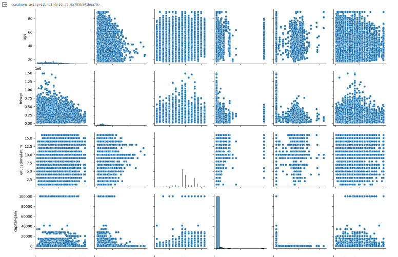
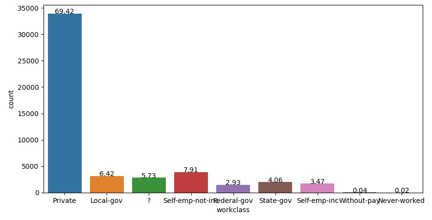
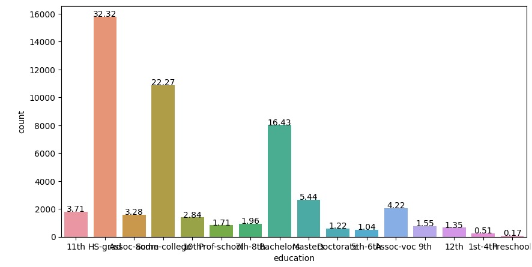
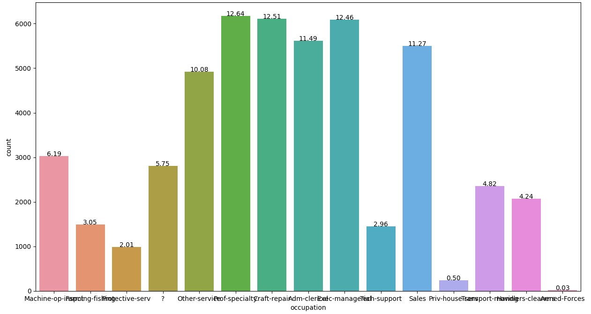
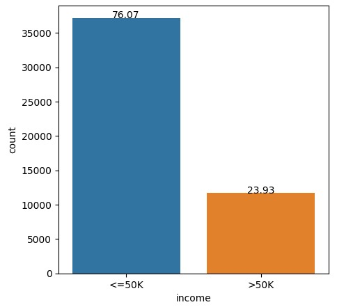
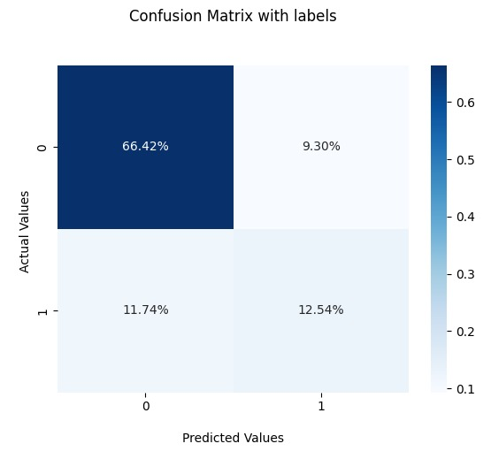
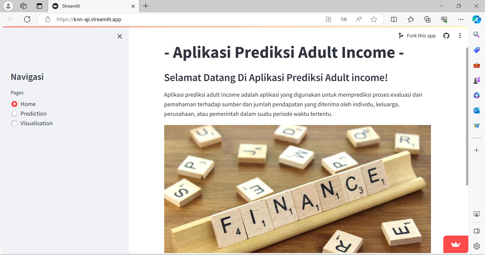
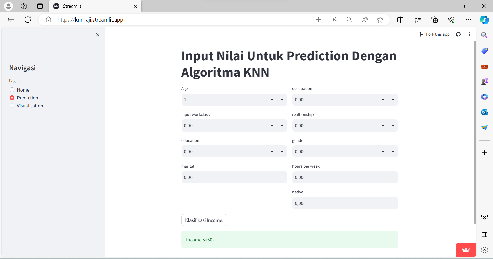
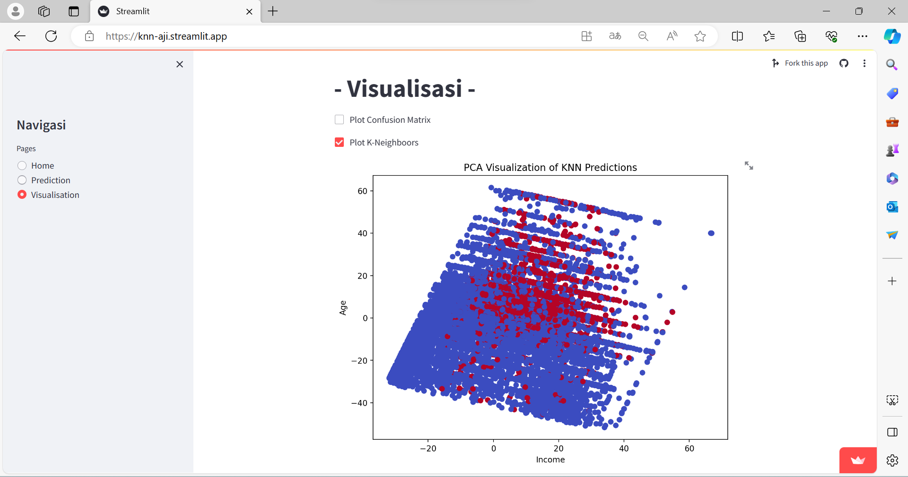

# Laporan Proyek Machine Learning

### Nama : Aji Ridwan Mas

### Nim : 211351008

### Kelas : Pagi A

## Domain Proyek


Dalam era digital ini, semakin banyak data yang dihasilkan oleh individu dalam kehidupan sehari-hari. Data tersebut mencakup berbagai aspek, mulai dari pekerjaan, pendidikan, hingga gaya hidup. Dalam konteks ini, penelitian ini bertujuan untuk mengembangkan model klasifikasi pendapatan seseorang berdasarkan data kehidupannya. Klasifikasi pendapatan dapat memberikan wawasan yang berharga bagi berbagai pihak, termasuk pemerintah, peneliti, dan masyarakat umum. Pertanyaan yang mendasari penelitian ini adalah bagaimana kita dapat memanfaatkan data kehidupan sehari-hari seseorang untuk memprediksi kategori pendapatan mereka. Dengan pemahaman ini, kita dapat mengidentifikasi faktor-faktor apa yang paling berpengaruh dalam menentukan pendapatan seseorang. Apakah tingkat pendidikan, jenis pekerjaan, atau faktor lain yang lebih memengaruhi penghasilan seseorang?

## Business Understanding

### Problem Statements

- Bagaimana kita dapat mengembangkan model klasifikasi yang efektif untuk memprediksi pendapatan seseorang berdasarkan data kehidupan sehari-hari mereka?
- Apa saja faktor-faktor utama yang berkontribusi pada penentuan kategori pendapatan, dan sejauh mana pengaruh masing-masing faktor tersebut?

### Goals

- Mengembangkan Model Klasifikasi Efektif: Menciptakan model klasifikasi yang dapat memprediksi dengan akurat kategori pendapatan seseorang berdasarkan data kehidupan sehari-hari, dengan tujuan meningkatkan pemahaman tentang faktor-faktor yang memengaruhi tingkat pendapatan.
- Identifikasi Faktor Penentu Pendapatan: Mengidentifikasi faktor-faktor utama yang berkontribusi pada penentuan kategori pendapatan individu, untuk memberikan pandangan lebih mendalam tentang variabel-variabel yang signifikan dalam konteks klasifikasi pendapatan.

### Solution statements

- Membangun suatu sistem yang dapat mempelajari data untuk dilakukan klasifikasi pendapatan seseorang.
- Sistem berjalan dengan menggunakan metode KNN Clasifier yang dinilai cocok untuk melakukan klasifikasi.

## Data Understanding

Dataset yang digunakan berasal dari situs Kaggle. Dataset ini mengandung 48842 entries dan 15 columns<br>

Link Dataset: [Adult Income Dataset](https://www.kaggle.com/datasets/wenruliu/adult-income-dataset?resource=download).

### Variabel-variabel yang terdapat pada Dataset adalah sebagai berikut:

- age: continuous.
- workclass: Private, Self-emp-not-inc, Self-emp-inc, Federal-gov, Local-gov, State-gov, Without-pay, Never-worked.
- fnlwgt: continuous.
- education: Bachelors, Some-college, 11th, HS-grad, Prof-school, Assoc-acdm, Assoc-voc, 9th, 7th-8th, 12th, Masters, 1st-4th, 10th, Doctorate, 5th-6th, Preschool.
- education-num: continuous.
- marital-status: Married-civ-spouse, Divorced, Never-married, Separated, Widowed, Married-spouse-absent, Married-AF-spouse.
- occupation: Tech-support, Craft-repair, Other-service, Sales, Exec-managerial, Prof-specialty, Handlers-cleaners, Machine-op-inspct, Adm-clerical, Farming-fishing, Transport-moving, Priv-house-serv, Protective-serv, Armed-Forces.
- relationship: Wife, Own-child, Husband, Not-in-family, Other-relative, Unmarried.
- race: White, Asian-Pac-Islander, Amer-Indian-Eskimo, Other, Black.
- sex: Female, Male.
- capital-gain: continuous.
- capital-loss: continuous.
- hours-per-week: continuous.
- native-country: United-States, Cambodia, England, Puerto-Rico, Canada, Germany, Outlying-US(Guam-USVI-etc), India, Japan, Greece, South, China, Cuba, Iran, Honduras, Philippines, Italy, Poland, Jamaica, Vietnam, Mexico, Portugal, Ireland, France, Dominican-Republic, Laos, Ecuador, Taiwan, Haiti, Columbia, Hungary, Guatemala, Nicaragua, Scotland, Thailand, Yugoslavia, El-Salvador, Trinadad&Tobago, Peru, Hong, Holand-Netherlands.
- income_class: >50K, <=50K

## Exploratory Data Analyst (EDA)



### Data Workclass Terbanyak


Dari grafik diatas bisa kita lihat bahwa Private adalah workclass terbanyak di dataset ini.

### Data Education Terbanyak


Dari grafik diatas bisa kita lihat bahwa HS-Grade adalah data education terbanyak di dataset ini.

### Data Occupation Terbanyak


Dari grafik diatas bisa kita lihat bahwa Prof-specialty adalah data Occupation terbanyak di dataset ini.

### Data Income Class Terbanyak


Dari grafik diatas bisa kita lihat bahwa Income class <=50k adalah data Income Class terbanyak di dataset ini.

## Data Preparation

Pertama-tama import semua library yang dibutuhkan,

```bash
import pandas as pd
import numpy as np
import matplotlib.pyplot as plt
import seaborn as sns

from sklearn import preprocessing
from sklearn.model_selection import train_test_split
from sklearn.preprocessing import RobustScaler
from sklearn.model_selection import train_test_split

from sklearn.neighbors import KNeighborsClassifier
from sklearn.metrics import accuracy_score
from sklearn.metrics import precision_score
from sklearn.metrics import recall_score
from sklearn.metrics import f1_score
from sklearn.metrics import classification_report
from sklearn.metrics import confusion_matrix

from sklearn.model_selection import cross_val_score
```

Setelah itu kita akan men-definsikan dataset menggunakan fungsi pada library pandas

```bash
data = pd.read_csv('/content/AID/adult.csv')
```

Lalu kita akan melihat informasi mengenai dataset dengan syntax seperti dibawah:

```bash
df.info()
```

Dengan hasil sebagai berikut:

```bash
RangeIndex: 48842 entries, 0 to 48841
Data columns (total 15 columns):
 #   Column           Non-Null Count  Dtype
---  ------           --------------  -----
 0   age              48842 non-null  int64
 1   workclass        48842 non-null  object
 2   fnlwgt           48842 non-null  int64
 3   education        48842 non-null  object
 4   educational-num  48842 non-null  int64
 5   marital-status   48842 non-null  object
 6   occupation       48842 non-null  object
 7   relationship     48842 non-null  object
 8   race             48842 non-null  object
 9   gender           48842 non-null  object
 10  capital-gain     48842 non-null  int64
 11  capital-loss     48842 non-null  int64
 12  hours-per-week   48842 non-null  int64
 13  native-country   48842 non-null  object
 14  income           48842 non-null  object
dtypes: int64(6), object(9)
memory usage: 5.6+ MB
```

### Memilih feature

Kita akan memilih beberapa kolom yang akan kita gunakan sebagai feature untuk model kita. Kolom yang tidak digunakan akan kita delete/drop dari dataframe dengan kode sebagai berikut:

```bash
del data['fnlwgt']
del data['educational-num']
del data['race']
del data['capital-gain']
del data['capital-loss']
```

Dan berikut adalah kolom yang dijadikan fitur untuk model kita:

```bash
Index(['age', 'workclass', 'education', 'marital_status', 'occupation',
       'relationship', 'gender', 'hours', 'native_country', 'income'],
      dtype='object')
```

### Merubah Seluruh Kolom Menjadi numerik

Kita akan merubah kolom fitur yang semula object menjadi numerik agar bisa kita olah dengan model kita dengan kode sebagai berikut:

```bash
label_encoder = preprocessing.LabelEncoder()

data['gender'] = label_encoder.fit_transform(data['gender'])
data['workclass'] = label_encoder.fit_transform(data['workclass'])
data['education'] = label_encoder.fit_transform(data['education'])
data['marital-status'] = label_encoder.fit_transform(data['marital-status'])
data['occupation'] = label_encoder.fit_transform(data['occupation'])
data['relationship'] = label_encoder.fit_transform(data['relationship'])
data['native-country'] = label_encoder.fit_transform(data['native-country'])
data['income'] = label_encoder.fit_transform(data['income'])
```

### Membagi datframe menjadi training dan testing

Setelah seluruh kolom bertipe data numerik, maka kita dapat membagi kolom fitur menjadi dua tipe yaitu training dan testing menggunakan kode dibawah:

```bash
x = data[['age', 'workclass', 'education', 'marital_status', 'occupation',
       'relationship', 'gender', 'hours', 'native_country']]
y = data['income']

x_train, x_test, y_train, y_test = train_test_split(x, y, test_size=0.30)
```

Berikut adalah jumlah data pada training dan testing:

> x_train: (34189, 9)
> x_test: (14653, 9)
> y_train: (34189,)
> y_test: (14653,)

## Modeling

Tahap pemodelan menggunakan teknik klasifikasi KNN dengan mengimport model tersebut dari library scikit-learn.

```bash
knn = KNeighborsClassifier(n_neighbors=9)

knn.fit(x_train, y_train)
```

## Evaluation

Untuk mengevaluasi model klasifikasi kita, kita akan memanfaatkan metode bernama Confussion Metrix. Berikut adalah hasik dari evaluasi model kita menggunakan confussion metrix:



Kita juga akan melihat skor akurasi dari model kita

```bash
Accuracy Score:  0.8008598921722514
Precision Score:  0.5880837359098229
Recall Score:  0.526984126984127
F1 Score:  0.5558599695585997
```

Kita melihat bahwa accuracy score model kita adalah 80% yang mengartikan bahwa model kita sudah berjalan dengan baik.

## Deployment

Link Streamlit:
[Streamlit App](https://knn-aji.streamlit.app/).

Screenshot Aplikasi:



